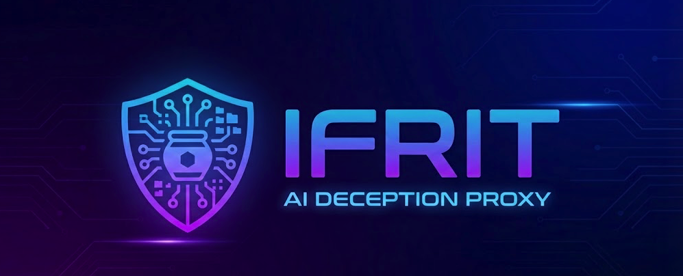

# IFRIT Proxy - AI-Powered Threat Deception & Intelligence
[](LICENSE)
[](CHANGELOG.md)


<div align="center">
  
</div>


---


## Overview

IFRIT is an AI-powered reverse proxy that intercepts incoming requests in real time, classifying each one as legitimate or malicious. Legitimate traffic is forwarded to backend; malicious traffic receives a customized AI-generated honeypot response that mimics the requested resource with fabricated data, deceiving attackers into wasting time on fake targets.

**NEW in v0.2.0:** Threat Intelligence enrichment (AbuseIPDB, VirusTotal, IPInfo) + rule-based notifications (Email, Slack, SMS via Twilio, Webhooks)

The proxy decision-making process follows a **four-stage pipeline**:

1. **Stage 0: Whitelist Check** - Does this IP/path have an exception? → Pass through
2. **Stage 1: Local Rules** - Does this match obvious attack patterns? → Honeypot
3. **Stage 2: Database Patterns** - Have we seen this attack before? → Honeypot (cached)
4. **Stage 3: LLM Analysis** - AI: Is this a novel attack? → Generate Honeypot response tailored to this specific attack

**Throughout this process:**
- Sensitive data is anonymized before reaching local/external LLMs (currently supports Anthropic Claude + Google Gemini)
- Attack patterns are learned and stored for future reference
- Attacker profiles are built based on behavior
- Threats enriched with 3rd-party intelligence (risk scoring, geolocation, reputation)
- All requests generate detailed logs for threat intelligence
- Multi-channel alerts via notifications system

Legitimate users access the real backend. Attackers receive deceptive honeypot responses. Your organization profiles every threat, enriches with external intelligence, and gets alerted via email/Slack/SMS—all based on settings.

---

## Key Features

### Real-Time Threat Detection

Four-stage pipeline detects attacks without requiring infrastructure changes:

- **Whitelist exceptions** - Critical paths bypass honeypot
- **Local rules** - Instant pattern matching (no API calls)
- **Database patterns** - Learned attacks cached locally (<10ms)
- **LLM analysis** - Novel threats analyzed by Claude/Gemini

### Threat Intelligence (NEW in v0.2.0)

Enrich detected attacks with external intelligence:

- **AbuseIPDB** - IP reputation and abuse history
- **VirusTotal** - Malware and C2 detection
- **IPInfo** - Geolocation and privacy detection (VPN/proxy/hosting/Tor)
- **Risk Scoring** - Weighted formula (0-100 score)
- **Threat Classification** - CRITICAL/HIGH/MEDIUM/LOW levels
- **24-Hour Caching** - Reduce API costs by 90%

**Example:**
```
Attack detected: SQL Injection from 1.2.3.4
├─ AbuseIPDB: 58/100 (156 reports)
├─ VirusTotal: 2 malware detections
├─ IPInfo: Australia, hosting provider
└─ Risk Score: 75 → HIGH threat
```

### Notifications System (NEW in v0.2.0)

Multi-channel alerts with rule-based filtering:

- **Email** - SMTP (Gmail, Mailtrap, SendGrid, custom)
- **Slack** - Webhook integration with color-coded severity
- **SMS** - Twilio integration for critical alerts
- **Webhooks** - Custom JSON payload delivery with retry logic

**Rule-Based Filtering:** Control which threats trigger alerts:
```json
"rules": {
  "alert_on_critical": true,    // Always alert
  "alert_on_high": false,       // Disabled by default
  "alert_on_medium": false,
  "alert_on_low": false
}
```

Reduce alert fatigue by alerting only on critical threats, escalate when needed.

### Enhanced Dashboard (NEW in v0.2.0)

Real-time dashboard at `http://localhost:8443/`:

- **Threat Intelligence Cards** - Display CRITICAL/HIGH/MEDIUM/LOW counts
- **Top Risky IPs** - Most dangerous attackers with risk scores and countries
- **Attack Statistics** - Total attacks, unique attackers, detection rate
- **Detection Stages** - Breakdown by S1 (Local Rules), S2 (DB Patterns), S3 (LLM)
- **API Token Authentication** - Secure access with 90-day expiring tokens

### Intelligent Learning

Each attack analyzed becomes a learned pattern:

- First attack: Claude/Gemini generate honeypot (~3 seconds)
- Subsequent attacks: Database cache (<10ms)
- **Result: 90% cost reduction after learning phase**

### Two Detection Modes

**Detection Mode (Default)**
- Smart threat analysis
- Optional whitelist for exceptions
- All other traffic analyzed
- Use for: Standard deployments

**Allowlist Mode (Strict)**
- Only whitelisted IPs/paths allowed
- Everything else blocked
- Zero false positives
- Use for: VPN-only, admin portals, strict zero-trust

See [DETECTION_MODES.md](docs/DETECTION_MODES.md) for detailed comparison.

### Three Execution Modes

**Onboarding Mode**
- Auto-learns legitimate traffic patterns
- Zero blocking
- 7-day default duration
- Auto-whitelists discovered legitimate paths

**Normal Mode**
- Full detection and honeypot responses
- Real-time learning
- Production-ready

### Payload Management System

Intelligent honeypot response selection:

- **Stage 1: Database** - Use learned payloads (cached)
- **Stage 2: LLM** - Claude/Gemini generates realistic responses
- **Stage 3: Config** - Fallback to configured defaults
- **Stage 4: Fallback** - Generic error if nothing matches

### Data Anonymization

Sensitive data is redacted before sending to external LLMs:

**Redacted:**
- Authentication tokens and credentials
- Session cookies
- API keys
- Email addresses
- Personal information

**Preserved (needed for detection):**
- HTTP method and path
- Attack patterns (SQL injection syntax, path traversal)
- Content-Type and User-Agent

**Compliance:**
- GDPR: PII anonymized before external API calls
- HIPAA: PHI protected
- PCI-DSS: Credit card data redacted
- CCPA: User data minimization

### CLI Management Tool

Complete command-line interface:
```bash
# View attacks
./ifrit-cli attack list
./ifrit-cli attack view 1
./ifrit-cli attack stats
./ifrit-cli attack by-ip 192.168.1.1
./ifrit-cli attack by-path /api/users

# Manage patterns
./ifrit-cli pattern list
./ifrit-cli pattern view 1
./ifrit-cli pattern add sql_injection "1 OR 1=1"
./ifrit-cli pattern remove 1

# View attacker profiles
./ifrit-cli attacker list
./ifrit-cli attacker view 1
./ifrit-cli attacker search 192.168.1.1

# Manage exceptions (whitelist)
./ifrit-cli exception list
./ifrit-cli exception add 10.0.0.1 /health
./ifrit-cli exception remove 1

# View threat intelligence
./ifrit-cli threat list
./ifrit-cli threat view 1.2.3.4
./ifrit-cli threat top 10
./ifrit-cli threat stats

# Database operations
./ifrit-cli db stats
./ifrit-cli db schema
```

### REST API

JSON API for integrations:
```bash
# Get recent attacks
curl -H "X-API-Token: YOUR_TOKEN" http://localhost:8443/api/attacks

# Get attacker profiles
curl -H "X-API-Token: YOUR_TOKEN" http://localhost:8443/api/attackers

# Get learned patterns
curl -H "X-API-Token: YOUR_TOKEN" http://localhost:8443/api/patterns

# Get threat intelligence
curl -H "X-API-Token: YOUR_TOKEN" http://localhost:8443/api/threat-intel/stats
curl -H "X-API-Token: YOUR_TOKEN" http://localhost:8443/api/threat-intel/top?limit=10

# Get notification config
curl -H "X-API-Token: YOUR_TOKEN" http://localhost:8443/api/notifications/config

# Update notification rules
curl -X POST -H "X-API-Token: YOUR_TOKEN" \
  -H "Content-Type: application/json" \
  -d '{"alert_on_critical": true, "alert_on_high": true}' \
  http://localhost:8443/api/notifications/config/update

# Get cache statistics
curl -H "X-API-Token: YOUR_TOKEN" http://localhost:8443/api/cache/stats

# Clear cache
curl -X POST -H "X-API-Token: YOUR_TOKEN" http://localhost:8443/api/cache/clear
```

See [API_ENDPOINTS.md](docs/API_ENDPOINTS.md) for complete API documentation.

### Threat Intelligence

Actionable intelligence from attack analysis:

- **Attack classification** - Type, severity, technique
- **Attacker profiles** - IP, first seen, last seen, total requests
- **Pattern database** - Learned signatures with confidence scores
- **Timeline tracking** - Attacker progression and tool evolution
- **Risk scoring** - Weighted intelligence from multiple sources
- **Geolocation** - Country and city of attackers
- **Infrastructure detection** - VPN, proxy, hosting, Tor exit nodes

---

## How It Works

### Request Flow
```
Incoming Request
    ↓
[Stage 0] Whitelist Check
├─ Is IP whitelisted? → ALLOW ✓
├─ Is path whitelisted? → ALLOW ✓
└─ Continue to Stage 1
    ↓
[Stage 1] Local Rules
├─ Matches obvious attack signature? → HONEYPOT ✓
└─ Continue to Stage 2
    ↓
[Stage 2] Database Patterns
├─ Matches learned pattern? → HONEYPOT ✓
└─ Continue to Stage 3
    ↓
[Stage 3] LLM Analysis (POST/PUT/DELETE only)
├─ Claude/Gemini confirms attack? → HONEYPOT ✓
└─ Not an attack
    ↓
[Threat Intelligence Enrichment]
├─ Enrich with AbuseIPDB, VirusTotal, IPInfo
├─ Calculate risk score (0-100)
├─ Assign threat level (LOW/MEDIUM/HIGH/CRITICAL)
└─ Check notification rules
    ↓
[Notifications]
├─ Is threat level rule enabled? → Send alerts
│  ├─ Email
│  ├─ Slack
│  ├─ SMS
│  └─ Webhooks
└─ Log to history
    ↓
[Forward] Legitimate Traffic
└─ Pass to backend ✓
```

### Payload Selection

When an attack is detected, the response is selected by priority:
```
Attack Detected (e.g., sql_injection)
    ↓
[1] Database: Any stored payload? → Use it ✓
    ↓
[2] LLM: Generate dynamic? → Claude/Gemini create response ✓
    ↓
[3] Config: Attack type in defaults? → Use it ✓
    ↓
[4] Fallback: Generic error → 500 response ✓
```

### Learning Process
```
Hour 1: 100 attacks, 40 unique types
├─ Detect → 40 Claude/Gemini calls → $0.12 cost
├─ Store patterns in DB
├─ Enrich with threat intel
└─ Honeypot responses cached

Hour 2: 100 attacks, same 40 types
├─ Database pattern matches → 0 Claude/Gemini calls
├─ Threat intel cached (24h) → 0 API calls
├─ Cached responses + intel used
└─ $0.00 cost (100% savings!)
```

### Threat Intelligence Pipeline
```
Attack Detected
    ↓
Extract Source IP
    ↓
Check Cache (24-hour TTL)
├─ Found? → Use cached data ✓
└─ Not found?
    ↓
Parallel Enrichment (3 workers)
├─ AbuseIPDB: Reputation score (0-100)
├─ VirusTotal: Malware detections
└─ IPInfo: Geolocation + privacy flags
    ↓
Risk Score Calculation
├─ Formula: (AbuseIPDB × 0.4) + (VirusTotal × 0.35) + (IPInfo × 0.25) <= (can be customized based on needs)
├─ Result: 0-100 score
└─ Assign level: LOW/MEDIUM/HIGH/CRITICAL
    ↓
Store in Database (24h cache)
    ↓
Check Notification Rules
└─ Send alerts if enabled for this threat level
```

---

## Architecture

### Components

**Reverse Proxy Engine**
- Listens on configured port (8080/8443)
- Routes traffic to backend or honeypot
- Written in Go for high performance
- TLS/HTTPS support

**Detection Engine**
- Four-stage pipeline decision logic
- Whitelist exception checking
- Local rule pattern matching
- LLM integration for novel threats
- Data anonymization before external APIs

**Threat Intelligence Engine (NEW)**
- Parallel enrichment with 3 worker goroutines
- Integration with AbuseIPDB, VirusTotal, IPInfo
- Risk score calculation and threat classification
- 24-hour caching for cost optimization
- Non-blocking background enrichment

**Notification Engine (NEW)**
- Multi-channel delivery (Email, Slack, SMS, Webhooks)
- Rule-based filtering by threat level
- Retry logic for failed notifications
- Audit trail of sent alerts
- Configuration API for dynamic rules

**Payload Management**
- Intelligent response selection
- Database caching of learned payloads
- LLM-based dynamic generation
- Config-based defaults
- Graceful fallback

**Learning Engine**
- Captures attack signatures
- Stores learned patterns in database
- Tracks confidence scores
- Builds attacker profiles

**Data Layer**
- SQLite/PostgreSQL database (local, no external deps)
- Stores exceptions, patterns, attacks, profiles, threat intelligence
- Fast pattern matching optimized queries
- Foreign key relationships for data integrity

**REST API & CLI**
- Query interface for all data
- Pattern management
- Exception/whitelist management
- Statistics and analytics
- Threat intelligence queries
- Notification configuration

---

## Configuration

All configuration through JSON (`config/default.json`). 

### Quick Start
```bash
# Copy template
cp config/default.json.example config/default.json

# Add your API keys to config/default.json
# - Claude/Gemini API key (for LLM)
# - AbuseIPDB key (for threat intel)
# - VirusTotal key (for threat intel)
# - IPInfo key (for threat intel)
# - SMTP credentials (for email notifications)
# - Slack webhook (for Slack alerts)
# - Twilio credentials (for SMS alerts)

# Build and run
go build -o ifrit ./cmd/ifrit
./ifrit &

```

**Note:** The database (`./data/ifrit.db`) is created automatically on first run based on the path in `config/default.json`.

## IFRIT CLI Management Tool

Build the CLI in the project root (same directory as `config/` and `data/`):

```bash
go build -o ifrit-cli ./cmd/ifrit-cli
./ifrit-cli --help
```


### Detection Modes

**Detection Mode (Default)**
```json
{
  "detection": {
    "mode": "detection",
    "enable_local_rules": true,
    "enable_llm": true,
    "whitelist_ips": [],
    "whitelist_paths": []
  }
}
```

**Allowlist Mode (Strict)**
```json
{
  "detection": {
    "mode": "allowlist",
    "whitelist_ips": ["192.168.1.100", "192.168.1.101"],
    "whitelist_paths": ["/health", "/status"]
  }
}
```

### Threat Intelligence
```json
{
  "threat_intelligence": {
    "enabled": true,
    "cache_ttl_hours": 24,
    "enrichment_workers": 3,
    "apis": {
      "abuseipdb": {
        "enabled": true,
        "api_key": "${ABUSEIPDB_API_KEY}",
        "timeout_seconds": 10
      },
      "virustotal": {
        "enabled": true,
        "api_key": "${VIRUSTOTAL_API_KEY}",
        "timeout_seconds": 10
      },
      "ipinfo": {
        "enabled": true,
        "api_key": "${IPINFO_API_KEY}",
        "timeout_seconds": 10
      }
    },
    "threat_level_thresholds": {
      "critical": 80,
      "high": 60,
      "medium": 40,
      "low": 0
    }
  }
}
```

### Notifications
```json
{
  "notifications": {
    "enabled": true,
    "providers": {
      "email": {
        "enabled": true,
        "smtp_host": "smtp.gmail.com",
        "smtp_port": 587,
        "smtp_username": "${SMTP_USERNAME}",
        "smtp_password": "${SMTP_PASSWORD}",
        "from_address": "alerts@ifrit.local"
      },
      "slack": {
        "enabled": true,
        "webhook_url": "${SLACK_WEBHOOK_URL}"
      },
      "twilio": {
        "enabled": false,
        "account_sid": "${TWILIO_ACCOUNT_SID}",
        "auth_token": "${TWILIO_AUTH_TOKEN}",
        "from_number": "${TWILIO_FROM_NUMBER}",
        "to_number": "${TWILIO_TO_NUMBER}"
      }
    },
    "rules": {
      "alert_on_critical": true,
      "alert_on_high": false,
      "alert_on_medium": false,
      "alert_on_low": false
    }
  }
}
```

### Execution Modes
```json
{
  "execution_mode": {
    "mode": "onboarding",
    "onboarding_auto_whitelist": true,
    "onboarding_duration_days": 7,
    "onboarding_log_file": "./logs/onboarding_traffic.log"
  }
}
```

Options: `onboarding`, `learning`, `normal`

### Payload Management
```json
{
  "payload_management": {
    "generate_dynamic_payload": true,
    "dynamic_llm_cache_ttl": 86400,
    "default_responses": {
      "sql_injection": {
        "content": {"error": "Forbidden"},
        "status_code": 403
      }
    }
  }
}
```

### Anonymization
```json
{
  "anonymization": {
    "enabled": true,
    "strategy": "hybrid",
    "store_original": true,
    "sensitive_headers": [
      "Authorization",
      "Cookie",
      "X-API-Key"
    ]
  }
}
```

---

## Documentation

- **[START_HERE.md](docs/START_HERE.md)** - Quick navigation guide
- **[INSTALLATION.md](docs/INSTALLATION.md)** - Detailed setup instructions
- **[DETECTION_MODES.md](docs/DETECTION_MODES.md)** - Detection vs Allowlist modes
- **[THREAT_INTELLIGENCE.md](docs/THREAT_INTELLIGENCE.md)** - Threat intel guide (NEW)
- **[NOTIFICATIONS.md](docs/NOTIFICATIONS.md)** - Notification system (NEW)
- **[API_ENDPOINTS.md](docs/API_ENDPOINTS.md)** - Complete API reference (NEW)
- **[FEATURES.md](docs/FEATURES.md)** - Complete feature list
- **[DECEPTIVE_PAYLOADS_MANAGEMENT.md](docs/DECEPTIVE_PAYLOADS_MANAGEMENT.md)** - Honeypot system
- **[ANONYMIZATION_TESTING.md](docs/ANONYMIZATION_TESTING.md)** - Data privacy details

---

## Contributing

IFRIT is developed openly on GitHub under Apache License 2.0. For Commercial support, new feature requests or integrations, and any other inquiries please contact ifrit@0t.systems

**Contributions welcome:**
- New LLM providers (GPT, Llama, etc.)
- SIEM integrations (Wazuh, Splunk, ELK)
- Threat intelligence providers
- Notification channels
- Payload templates for new attack types
- Detection improvements and pattern refinements
- Documentation and examples

See [CONTRIBUTING.md](CONTRIBUTING.md) for guidelines.

---

## Roadmap (v0.3.0+)

- [ ] Machine learning scoring boost (higher CRITICAL rates)
- [ ] Advanced SIEM integrations (Wazuh, Splunk)
- [ ] PostgreSQL/MySQL support
- [ ] Notification scheduling & quiet hours
- [ ] Attack deduplication
- [ ] Notification batching
- [ ] Escalation policies
- [ ] Response automation
- [ ] Clustering & load balancing

---

## License

IFRIT Proxy is licensed under [Apache License 2.0](LICENSE). For commercial support, custom integration or other requests please contact ifrit@0t.systems

---

## Support

**Security Issues, Bug reports, General inquiries**
- Email: [ifrit@0t.systems](mailto:ifrit@0t.systems)

---

## Acknowledgments

Built with Go, SQLite, Anthropic/Google AI, and the security community's collective threat intelligence.

**v0.2.1 Contributors:** 0tSystems Security Team
