<div align="center">


### 🔥 AI-Powered Threat Deception & Intelligence Platform


**Turn attackers into intelligence sources with adaptive honeypot responses**

[](LICENSE)
[](CHANGELOG.md)
[](https://go.dev)
[]()
[]()

**[📦 Quick Start](#-quick-start)** • **[✨ Features](#-what-makes-ifrit-different)** • **[🔄 How It Works](#-how-it-works)** • **[📚 Docs](docs/START_HERE.md)** • **[🔌 API](docs/API_ENDPOINTS.md)**

---

### Brought to the community by
<a href="https://www.0t.systems" target="_blank">
  
</a>

---

</div>

---


## 🎯 What is IFRIT?

IFRIT is an **intelligent reverse proxy** that sits between the internet and your applications, analyzing every request in real-time. Legitimate traffic flows through seamlessly. Malicious traffic? It gets served AI-generated honeypot responses that waste attackers' time while you gather intelligence.

<div align="center">

### 🏗️ System Architecture

```mermaid
graph TB
    subgraph Internet
        A[👤 Attacker]
        L[✅ Legitimate User]
    end
    
    subgraph "IFRIT Proxy Layer"
        B[🛡️ IFRIT Proxy]
        
        subgraph "AI Detection Engine"
            C1[🤖 Claude Sonnet 4]
            C2[🤖 Gemini 2.0 Flash]
        end
        
        subgraph "Threat Intelligence"
            D1[📊 AbuseIPDB]
            D2[🦠 VirusTotal]
            D3[🌍 IPInfo]
        end
    end
    
    subgraph Backend
        E[🎯 Your Application]
    end
    
    subgraph "Attacker Receives"
        F[🍯 Fake Data<br/>Honeypot Response]
    end
    
    subgraph "User Receives"
        G[📦 Real Data<br/>Protected]
    end
    
    A -->|Malicious Request| B
    L -->|Normal Request| B
    
    B --> C1
    B --> C2
    
    B --> D1
    B --> D2
    B --> D3
    
    B -->|Attack Detected| F
    B -->|Legitimate| E
    E -->|Response| G
    
    F -.->|Wasted Time| A
    G -->|Secure Access| L
    
    style A fill:#ff6b6b,stroke:#c92a2a,stroke-width:2px,color:#fff
    style L fill:#51cf66,stroke:#2f9e44,stroke-width:2px,color:#fff
    style B fill:#4c6ef5,stroke:#364fc7,stroke-width:3px,color:#fff
    style C1 fill:#845ef7,stroke:#5f3dc4,stroke-width:2px,color:#fff
    style C2 fill:#845ef7,stroke:#5f3dc4,stroke-width:2px,color:#fff
    style D1 fill:#ff922b,stroke:#e8590c,stroke-width:2px,color:#fff
    style D2 fill:#ff922b,stroke:#e8590c,stroke-width:2px,color:#fff
    style D3 fill:#ff922b,stroke:#e8590c,stroke-width:2px,color:#fff
    style E fill:#20c997,stroke:#12b886,stroke-width:2px,color:#fff
    style F fill:#fa5252,stroke:#c92a2a,stroke-width:2px,color:#fff
    style G fill:#51cf66,stroke:#2f9e44,stroke-width:2px,color:#fff
```


<details>
<summary><b>🎨 Click here to expand the interactive Diagram</b></summary>
  


</details>

**Simplified flow:**

<div align="center">
  
</div>

</div>


---


## 🚀 Quick Start

> **Get up and running in under 2 minutes**

### 📦 Installation

<table>
<tr>
<td width="50%">

**macOS (Apple Silicon)**

```bash
curl -LO https://github.com/0tSystemsPublicRepos/\
IfritProxy/releases/download/v0.3.1/\
ifrit-v0.3.1-darwin-arm64.tar.gz

tar -xzf ifrit-v0.3.1-darwin-arm64.tar.gz
cd ifrit-v0.3.1-darwin-arm64
./install.sh
```

</td>
<td width="50%">

**Linux (x64)**

```bash
curl -LO https://github.com/0tSystemsPublicRepos/\
IfritProxy/releases/download/v0.3.1/\
ifrit-v0.3.1-linux-amd64.tar.gz

tar -xzf ifrit-v0.3.1-linux-amd64.tar.gz
cd ifrit-v0.3.1-linux-amd64
./install.sh
```

</td>
</tr>
</table>

<div align="center">


*Installation in action - it's really that simple!*

</div>

### ⚙️ Configuration (Quick Setup)

```bash
# 1. Copy template
cp config/default.json.example config/default.json

# 2. Add your API keys
nano config/default.json  # or use your favorite editor
```

**Minimal configuration to get started:**

```json
{
  "llm": {
    "provider": "claude",  // 👈 Choose: "claude" or "gemini"
    "claude": {
      "api_key": "sk-ant-..."  // 🔑 Get from console.anthropic.com
    }
  },
  "proxy": {
    "listen_port": 8080,
    "backend_url": "http://localhost:3000"  // 🎯 Your app
  }
}
```

### 🎬 Launch

Build the source code or Install from the available binaries

```bash
# Build the binary
go build -o ifrit ./cmd/ifrit
(optional: build ifrit-cli as well)

# Start IFRIT (runs in background)
./ifrit &

# 🎉 You're protected! Access dashboard:
open http://localhost:8443
```

**That's it!** IFRIT is now protecting your application.


---


## ✨ What Makes IFRIT Different?

<div align="center">

### 💎 Core Capabilities

</div>

<table>
<tr>
<td width="50%" valign="top">

### 🧠 **Multi-AI Intelligence**

Choose your AI provider or let IFRIT auto-fallback:

- **🎯 Claude Sonnet 4** - Industry-leading security analysis
- **⚡ Gemini 2.0 Flash** - Cost-effective, lightning fast  
- **🔄 Auto Fallback** - Seamless provider switching
- **💰 90% Cost Reduction** - Through intelligent caching

```json
{
  "provider": "claude",  // or "gemini"
  "cache_ttl": 86400    // 24h learning
}
```

</td>
<td width="50%" valign="top">

### 🗄️ **Production-Grade Storage**

Database flexibility for any scale:

- **📦 SQLite** - Zero-config, perfect for single servers
- **🐘 PostgreSQL** - Enterprise scale, clustered deployments
- **🔌 Provider Abstraction** - Switch with config only
- **🛠️ Unified CLI** - Same commands, any database

```bash
# Works with both!
./ifrit-cli attack list
./ifrit-cli pattern add sql_injection
```

</td>
</tr>

<tr>
<td width="50%" valign="top">

### 🎭 **Adaptive Deception Engine**

Intelligent honeypot responses that learn:

- **🎨 AI-Generated** - Realistic fake data matching your app
- **📚 Pattern Learning** - First attack = 3s, next = 10ms
- **🎯 Context-Aware** - Mimics requested resources
- **⏱️ Time Wasting** - Keeps attackers busy with fake targets

**Example:** SQL injection gets fake user database, path traversal gets fake file listings.

</td>
<td width="50%" valign="top">

### 🔍 **Threat Intelligence Hub**

Real-time enrichment from multiple sources:

- **🚨 AbuseIPDB** - IP reputation (0-100 score)
- **🦠 VirusTotal** - Malware & C2 detection  
- **🌍 IPInfo** - Geolocation, VPN, Tor, hosting
- **⚖️ Risk Scoring** - Weighted formula → threat level

```
IP: 45.67.89.12
├─ AbuseIPDB: 87/100 (234 reports)
├─ VirusTotal: 3 malware hits
├─ IPInfo: Russia, Tor exit node
└─ Risk: 92 → 🔴 CRITICAL
```

</td>
</tr>

<tr>
<td width="50%" valign="top">

### 📢 **Smart Alert System**

Multi-channel notifications with zero fatigue:

- **📧 Email** - SMTP (Gmail, SendGrid, custom)
- **💬 Slack** - Webhook with color-coded severity
- **📱 SMS** - Twilio for critical threats only
- **🔗 Webhooks** - Custom JSON with retry logic

**Rule-Based Filtering:**
```json
"rules": {
  "alert_on_critical": true,   // ✅ Always
  "alert_on_high": false,      // 🔇 Quiet
  "alert_on_medium": false,    // 🔇 Quiet
  "alert_on_low": false        // 🔇 Quiet
}
```

</td>
<td width="50%" valign="top">

### 📊 **Complete Visibility**

Real-time intelligence at your fingertips:

- **🎯 Live Dashboard** - Threat levels, top attackers, stats
- **🔌 REST API** - JSON endpoints for SIEM integration
- **⌨️ CLI Tools** - Complete command-line management
- **📈 Analytics** - Attack timelines, attacker profiles

```bash
# Query your intelligence
./ifrit-cli threat top 10
./ifrit-cli attacker view 45.67.89.1
./ifrit-cli attack stats --last-24h
```

**API-first design** - integrate with any security stack.

</td>
</tr>
</table>


---


## 🔄 How It Works

<div align="center">

### The Four-Stage Detection Pipeline

```mermaid
flowchart TD
    Start([🌐 Incoming Request]) --> Stage0{🔓 Stage 0<br/>Whitelist Check}
    
    Stage0 -->|✅ Whitelisted IP/Path| Allow[✅ ALLOW<br/>Pass to Backend]
    Stage0 -->|❌ Not Whitelisted| Stage1{⚡ Stage 1<br/>Local Rules}
    
    Stage1 -->|🎯 Attack Pattern Match| Honeypot[🍯 HONEYPOT<br/>Deceptive Response]
    Stage1 -->|❓ Unknown Pattern| Stage2{💾 Stage 2<br/>Database Patterns}
    
    Stage2 -->|📚 Known Attack| Honeypot
    Stage2 -->|🆕 Novel Attack| Stage3{🤖 Stage 3<br/>LLM Analysis}
    
    Stage3 -->|🚨 Attack Confirmed| Honeypot
    Stage3 -->|✅ Legitimate| Allow
    
    Honeypot --> TI[🔍 Threat Intelligence<br/>Enrichment]
    TI --> Notify[📢 Notifications<br/>If Rules Match]
    Notify --> Learn[📖 Learn & Store<br/>Pattern]
    
    Allow --> Backend[🎯 Your Application]
    Backend --> Response[📦 Real Response]
    
    Learn --> LogAttack[(📊 Attack Database)]
    
    style Start fill:#4c6ef5,stroke:#364fc7,stroke-width:3px,color:#fff
    style Stage0 fill:#7950f2,stroke:#5f3dc4,stroke-width:2px,color:#fff
    style Stage1 fill:#7950f2,stroke:#5f3dc4,stroke-width:2px,color:#fff
    style Stage2 fill:#7950f2,stroke:#5f3dc4,stroke-width:2px,color:#fff
    style Stage3 fill:#7950f2,stroke:#5f3dc4,stroke-width:2px,color:#fff
    style Allow fill:#51cf66,stroke:#2f9e44,stroke-width:3px,color:#fff
    style Honeypot fill:#ff6b6b,stroke:#c92a2a,stroke-width:3px,color:#fff
    style TI fill:#ff922b,stroke:#e8590c,stroke-width:2px,color:#fff
    style Notify fill:#fab005,stroke:#f08c00,stroke-width:2px,color:#fff
    style Learn fill:#20c997,stroke:#12b886,stroke-width:2px,color:#fff
    style Backend fill:#339af0,stroke:#1c7ed6,stroke-width:2px,color:#fff
    style Response fill:#51cf66,stroke:#2f9e44,stroke-width:2px,color:#fff
    style LogAttack fill:#868e96,stroke:#495057,stroke-width:2px,color:#fff
```

</div>

<details> 
<summary><b>🎨 Click here to expand the interactive Diagram</b></summary>



</details>


### 🎯 What Happens After Detection?
</br>
<div align="center">
  
</div>


### 🔬 Intelligence Enrichment Pipeline

Every detected attack triggers **parallel intelligence gathering** in the background:
</br>
<div align="center">
  
</div>


**Performance Characteristics:**

| Scenario | Behavior | Latency | Cost |
|----------|----------|---------|------|
| **First Attack from IP** | All 3 APIs called | ~500ms | $0.003 |
| **Repeat Attack (< 24h)** | Cache hit, no APIs | <10ms | $0.00 |
| **After 24h** | Re-enrich, update cache | ~500ms | $0.003 |

**💡 Result:** 90%+ cache hit rate = minimal API costs + fast lookups


### 💰 Learning Economics: Cost Optimization

IFRIT learns from every attack, dramatically reducing operational costs:

<table>
<tr>
<th width="50%">⏰ Hour 1: Initial Learning Phase</th>
<th width="50%">🚀 Hour 2: Optimized Operation</th>
</tr>
<tr>
<td valign="top">

**First Exposure**

```
📊 Traffic Analysis
├─ 100 requests received
├─ 40 unique attack types
│
├─ 🤖 AI Calls Needed
│  ├─ Stage 3 LLM: 40 calls
│  └─ Cost: ~$0.12
│
├─ 🔍 Threat Intel APIs
│  ├─ 40 unique IPs
│  └─ Cost: ~$0.12
│
└─ 💾 Storage
   ├─ Learn all 40 patterns
   ├─ Cache threat intel (24h)
   └─ Generate honeypots

📈 Total Cost: $0.24
```

**What Happened:**
- ✅ All attacks detected
- ✅ Patterns learned
- ✅ Intelligence cached
- ✅ Attackers deceived

</td>
<td valign="top">

**Cached Intelligence**

```
📊 Traffic Analysis
├─ 100 requests received
├─ Same 40 attack types
│
├─ 💾 Database Hits
│  ├─ Stage 2: All 40 matched
│  ├─ Response time: <10ms each
│  └─ Cost: $0.00
│
├─ 💰 Cache Hits
│  ├─ Same 40 IPs
│  ├─ Threat intel from cache
│  └─ Cost: $0.00
│
└─ 🎯 Results
   ├─ Same quality detection
   ├─ Faster responses
   └─ Zero API costs

📉 Total Cost: $0.00
```

**What Happened:**
- ✅ 100% cache hit rate
- ✅ 90ms → 10ms latency
- ✅ **100% cost savings!**
- ✅ Same protection level

</td>
</tr>
</table>

**📊 Real-World Scenario (30 Days):**

```
Day 1:  5,000 attacks, 200 unique → $6.00 in API costs
Day 2:  5,000 attacks, 150 new    → $4.50 in API costs
Day 3:  5,000 attacks, 100 new    → $3.00 in API costs
...
Day 7:  5,000 attacks,  50 new    → $1.50 in API costs
Day 14: 5,000 attacks,  20 new    → $0.60 in API costs
Day 30: 5,000 attacks,  10 new    → $0.30 in API costs

Total: 150,000 attacks handled
Cost without caching: ~$450.00
Cost with IFRIT learning: ~$45.00
💰 Savings: $405.00 (90% reduction!)
```


---


## 🎛️ Two Detection Modes

<div align="center">

Choose your security philosophy: **trust but verify** vs **zero trust**

</div>

<table>
<tr>
<th width="50%">🔍 Detection Mode (Default)</th>
<th width="50%">🛡️ Allowlist Mode (Strict Zero Trust)</th>
</tr>

<tr>
<td valign="top">

### Philosophy
> **"Trust, but verify"** - Analyze everything intelligently

### Configuration
```json
{
  "detection": {
    "mode": "detection",
    "enable_local_rules": true,
    "enable_llm": true,
    "whitelist_ips": [],      // Optional
    "whitelist_paths": []     // Optional
  }
}
```

### How It Works
```
Incoming Request
    │
    ├─ Whitelisted? ──▶ ✅ ALLOW
    │
    ├─ Stage 1 Match? ──▶ 🍯 HONEYPOT
    │
    ├─ Stage 2 Match? ──▶ 🍯 HONEYPOT
    │
    ├─ Stage 3 LLM? ────▶ 🍯 or ✅
    │
    └─ Default: Analyze with AI
```

### Best For
- ✅ Public-facing web applications
- ✅ REST APIs with unknown clients
- ✅ E-commerce platforms
- ✅ SaaS products
- ✅ Content delivery
- ✅ Marketing websites

### Advantages
- 🎯 Smart threat detection
- 📊 Learn from all traffic
- 🔄 Adaptive to new attacks
- 🌐 Works with dynamic users
- 📈 Builds intelligence database

### Disadvantages
- ⚠️ Requires tuning for false positives
- 🤖 Depends on AI accuracy
- ⏱️ Initial learning period

</td>

<td valign="top">

### Philosophy
> **"Deny by default"** - Only explicit trust passes

### Configuration
```json
{
  "detection": {
    "mode": "allowlist",
    "whitelist_ips": [
      "192.168.1.100",
      "10.0.0.0/24"
    ],
    "whitelist_paths": [
      "/health",
      "/metrics"
    ]
  }
}
```

### How It Works
```
Incoming Request
    │
    ├─ Whitelisted IP? ─▶ ✅ ALLOW
    │
    ├─ Whitelisted Path? ─▶ ✅ ALLOW
    │
    └─ Everything Else ──▶ 🚫 BLOCK
    
No AI analysis needed
No learning phase
Instant block
```

### Best For
- ✅ Admin panels
- ✅ Internal dashboards
- ✅ VPN-only services
- ✅ Backend APIs (private)
- ✅ Database management tools
- ✅ CI/CD webhooks

### Advantages
- 🔒 Maximum security
- ⚡ Zero latency (no AI)
- 🎯 Zero false positives
- 💰 Zero API costs
- 🛡️ Perfect for high-value targets

### Disadvantages
- ❌ Requires known IPs/paths
- 📋 Manual whitelist management
- 🚫 Blocks legitimate unknowns
- 🔧 Less flexible

</td>
</tr>

<tr>
<td colspan="2" align="center">

### 💡 **Pro Tip:** Hybrid Approach

Start with **Onboarding Mode** (7 days) to auto-discover legitimate patterns, then switch to your preferred mode:

```json
{
  "execution_mode": {
    "mode": "onboarding",              // Auto-learn for 7 days
    "onboarding_duration_days": 7,
    "onboarding_auto_whitelist": true  // Auto-add to whitelist
  }
}
```

After onboarding → Switch to **Detection Mode** or **Allowlist Mode** based on your needs

</td>
</tr>
</table>

**🎬 Execution Modes:**

| Mode | Purpose | Blocking | Learning | Duration |
|------|---------|----------|----------|----------|
| **🎓 Onboarding** | Learn legitimate traffic | ❌ No | ✅ Yes | 7 days (default) |
| **🛡️ Detection** | Full protection | ✅ Yes | ✅ Yes | Production |

See [DETECTION_MODES.md](docs/DETECTION_MODES.md) for detailed comparison and use cases.


---


## 📊 Dashboard & Management

<div align="center">

### 🎯 Real-Time Intelligence Dashboard

Access at **`http://localhost:8443/`** with API token authentication

</div>

**Dashboard Overview:**

The IFRIT dashboard provides real-time visibility into your security posture with:

- **📊 Threat Level Distribution** - Visual breakdown of CRITICAL/HIGH/MEDIUM/LOW threats
- **🎯 Top Risky Attackers** - Real-time ranking with risk scores, countries, and flags (Tor, VPN, Hosting)
- **⚡ Detection Pipeline Performance** - Stage-by-stage metrics showing cache efficiency
- **📈 Attack Trends** - 24-hour attack type breakdown with visual bars
- **🌍 Geographic Insights** - Attack source locations with flags

**Key Metrics Displayed:**
**parallel intelligence gathering** in the background:
</br>
<div align="center">
  
</div>
</br>

<div align="center">

</div>

> **💡 Pro Tip:** Generate your API token in `config/default.json` to access the dashboard


### ⌨️ CLI Management

Complete command-line control of your security intelligence:

<table>
<tr>
<td width="50%" valign="top">

#### 🚨 Attack Intelligence

```bash
# View recent attacks
./ifrit-cli attack list

# Detailed analysis
./ifrit-cli attack view 42

# Statistics
./ifrit-cli attack stats

# Filter by source
./ifrit-cli attack by-ip 45.67.89.1

# Filter by target
./ifrit-cli attack by-path /api/users

# Export to JSON
./ifrit-cli attack export \
  --format json \
  --output attacks.json
```

#### 🧬 Pattern Management

```bash
# List learned signatures
./ifrit-cli pattern list

# View specific pattern
./ifrit-cli pattern view 15

# Add custom pattern
./ifrit-cli pattern add \
  sql_injection \
  "' OR '1'='1"

# Remove pattern
./ifrit-cli pattern remove 15

# Export patterns
./ifrit-cli pattern export
```

</td>
<td width="50%" valign="top">

#### 👤 Attacker Profiles

```bash
# List all attackers
./ifrit-cli attacker list

# Profile details
./ifrit-cli attacker view 5

# Search by IP
./ifrit-cli attacker search 45.67.89.1

# Top attackers
./ifrit-cli attacker top 10
```

#### 🔓 Whitelist/Exceptions

```bash
# List exceptions
./ifrit-cli exception list

# Add IP exception
./ifrit-cli exception add \
  --ip 10.0.0.1 \
  --reason "Office VPN"

# Add path exception
./ifrit-cli exception add \
  --path /health \
  --reason "Health check"

# Remove exception
./ifrit-cli exception remove 3
```

</td>
</tr>
<tr>
<td width="50%" valign="top">

#### 🔍 Threat Intelligence

```bash
# Recent threat intel
./ifrit-cli threat list

# IP details
./ifrit-cli threat view 45.67.89.1

# Top risky IPs
./ifrit-cli threat top 10

# Statistics
./ifrit-cli threat stats

# Force re-enrich IP
./ifrit-cli threat enrich 45.67.89.1
```

</td>
<td width="50%" valign="top">

#### 💾 Database Operations

```bash
# Database statistics
./ifrit-cli db stats

# View schema
./ifrit-cli db schema

# Vacuum (SQLite only)
./ifrit-cli db vacuum

# Export database
./ifrit-cli db export backup.sql
```

**🔄 Database-agnostic:** Same commands work for both SQLite and PostgreSQL!

</td>
</tr>
</table>


### 🔌 REST API

<div align="center">

**JSON API for seamless integration with your security stack**

</div>

Integrate IFRIT with SIEM, monitoring tools, or custom dashboards using our comprehensive REST API.

#### 🔐 Authentication

All API endpoints require authentication via API token:

```bash
# Include in every request
curl -H "X-API-Token: YOUR_TOKEN_HERE" \
  http://localhost:8443/api/...
```

**Generating API tokens:** Configure in `config/default.json` under `api.tokens`

---

#### 📡 Available Endpoints

<details>
<summary><b>🚨 Attack Intelligence</b></summary>

```bash
# Get recent attacks
curl -H "X-API-Token: YOUR_TOKEN" \
  http://localhost:8443/api/attacks

# Get specific attack
curl -H "X-API-Token: YOUR_TOKEN" \
  http://localhost:8443/api/attacks/42

# Filter by IP
curl -H "X-API-Token: YOUR_TOKEN" \
  "http://localhost:8443/api/attacks?ip=45.67.89.1"

# Filter by date range
curl -H "X-API-Token: YOUR_TOKEN" \
  "http://localhost:8443/api/attacks?from=2024-01-01&to=2024-01-31"

# Attack statistics
curl -H "X-API-Token: YOUR_TOKEN" \
  http://localhost:8443/api/attacks/stats
```

**Response Example:**
```json
{
  "attacks": [
    {
      "id": 42,
      "timestamp": "2024-01-15T14:23:45Z",
      "source_ip": "45.67.89.1",
      "attack_type": "sql_injection",
      "threat_level": "CRITICAL",
      "risk_score": 92,
      "detection_stage": 3,
      "path": "/api/users",
      "method": "POST"
    }
  ],
  "total": 1865,
  "page": 1
}
```

</details>

<details>
<summary><b>👤 Attacker Profiles</b></summary>

```bash
# List all attackers
curl -H "X-API-Token: YOUR_TOKEN" \
  http://localhost:8443/api/attackers

# Get specific attacker profile
curl -H "X-API-Token: YOUR_TOKEN" \
  http://localhost:8443/api/attackers/45.67.89.1

# Top attackers
curl -H "X-API-Token: YOUR_TOKEN" \
  "http://localhost:8443/api/attackers/top?limit=10"
```

**Response Example:**
```json
{
  "ip": "45.67.89.1",
  "first_seen": "2024-01-10T08:15:30Z",
  "last_seen": "2024-01-15T14:23:45Z",
  "total_attacks": 234,
  "attack_types": ["sql_injection", "path_traversal", "xss"],
  "risk_score": 87,
  "threat_level": "HIGH",
  "country": "CN",
  "is_vpn": false,
  "is_tor": false,
  "is_hosting": true
}
```

</details>

<details>
<summary><b>🧬 Learned Patterns</b></summary>

```bash
# Get all patterns
curl -H "X-API-Token: YOUR_TOKEN" \
  http://localhost:8443/api/patterns

# Get pattern by ID
curl -H "X-API-Token: YOUR_TOKEN" \
  http://localhost:8443/api/patterns/15

# Add new pattern
curl -X POST \
  -H "X-API-Token: YOUR_TOKEN" \
  -H "Content-Type: application/json" \
  -d '{
    "attack_type": "sql_injection",
    "signature": "' OR 1=1--",
    "confidence": 0.95
  }' \
  http://localhost:8443/api/patterns
```

</details>

<details>
<summary><b>🔍 Threat Intelligence</b></summary>

```bash
# Threat intel statistics
curl -H "X-API-Token: YOUR_TOKEN" \
  http://localhost:8443/api/threat-intel/stats

# Top risky IPs
curl -H "X-API-Token: YOUR_TOKEN" \
  "http://localhost:8443/api/threat-intel/top?limit=10"

# Get IP details
curl -H "X-API-Token: YOUR_TOKEN" \
  http://localhost:8443/api/threat-intel/45.67.89.1

# Force re-enrich IP
curl -X POST \
  -H "X-API-Token: YOUR_TOKEN" \
  http://localhost:8443/api/threat-intel/45.67.89.1/enrich
```

**Response Example:**
```json
{
  "ip": "45.67.89.1",
  "risk_score": 87,
  "threat_level": "HIGH",
  "abuseipdb": {
    "score": 91,
    "total_reports": 156,
    "last_reported": "2024-01-14T10:30:00Z"
  },
  "virustotal": {
    "malicious": 3,
    "suspicious": 1
  },
  "ipinfo": {
    "country": "CN",
    "city": "Shanghai",
    "is_vpn": false,
    "is_proxy": false,
    "is_tor": false,
    "is_hosting": true
  },
  "cached_at": "2024-01-15T14:23:45Z"
}
```

</details>

<details>
<summary><b>📢 Notifications Configuration</b></summary>

```bash
# Get notification config
curl -H "X-API-Token: YOUR_TOKEN" \
  http://localhost:8443/api/notifications/config

# Update notification rules
curl -X POST \
  -H "X-API-Token: YOUR_TOKEN" \
  -H "Content-Type: application/json" \
  -d '{
    "alert_on_critical": true,
    "alert_on_high": true,
    "alert_on_medium": false,
    "alert_on_low": false
  }' \
  http://localhost:8443/api/notifications/config/update

# Get notification history
curl -H "X-API-Token: YOUR_TOKEN" \
  http://localhost:8443/api/notifications/history

# Test notifications
curl -X POST \
  -H "X-API-Token: YOUR_TOKEN" \
  http://localhost:8443/api/notifications/test
```

</details>

<details>
<summary><b>💾 Cache Management</b></summary>

```bash
# Get cache statistics
curl -H "X-API-Token: YOUR_TOKEN" \
  http://localhost:8443/api/cache/stats

# Clear threat intel cache
curl -X POST \
  -H "X-API-Token: YOUR_TOKEN" \
  http://localhost:8443/api/cache/clear

# Clear specific IP from cache
curl -X DELETE \
  -H "X-API-Token: YOUR_TOKEN" \
  http://localhost:8443/api/cache/45.67.89.1
```

</details>

---

**📚 Complete API Documentation:** See [API_ENDPOINTS.md](docs/API_ENDPOINTS.md) for full reference including request/response schemas, error codes, and rate limits.


---

## 🔐 Privacy & Compliance

### Data Anonymization

Sensitive data is **automatically redacted** before reaching external LLMs:

| **Redacted** | **Preserved** |
|---|---|
| 🔒 Auth tokens & credentials | ✅ HTTP method/path |
| 🔒 Session cookies | ✅ Attack patterns |
| 🔒 API keys | ✅ Content-Type |
| 🔒 Email addresses | ✅ User-Agent |
| 🔒 Personal information | ✅ Attack signatures |

**Compliance coverage:**
- ✅ **GDPR** - PII anonymized before external API calls
- ✅ **HIPAA** - PHI protected from third parties
- ✅ **PCI-DSS** - Credit card data redacted
- ✅ **CCPA** - User data minimization enforced

See [ANONYMIZATION_TESTING.md](docs/ANONYMIZATION_TESTING.md) for details.

---

## ⚙️ Configuration

### Multi-LLM Setup

**Claude (Recommended for security):**
```json
{
  "llm": {
    "provider": "claude",
    "claude": {
      "api_key": "${ANTHROPIC_API_KEY}",
      "model": "claude-sonnet-4-20250514",
      "max_tokens": 4096,
      "temperature": 0.0
    }
  }
}
```

**Gemini (Cost-effective alternative):**
```json
{
  "llm": {
    "provider": "gemini",
    "gemini": {
      "api_key": "${GOOGLE_API_KEY}",
      "model": "gemini-2.0-flash-exp",
      "max_tokens": 4096,
      "temperature": 0.0
    }
  }
}
```

### Database Options

**SQLite (Default - Zero Config):**
```json
{
  "database": {
    "type": "sqlite",
    "sqlite": {
      "path": "./data/ifrit.db"
    }
  }
}
```

**PostgreSQL (Enterprise Scale):**
```json
{
  "database": {
    "type": "postgresql",
    "postgresql": {
      "host": "localhost",
      "port": 5432,
      "user": "ifrit_user",
      "password": "${POSTGRES_PASSWORD}",
      "database": "ifrit",
      "ssl_mode": "require"
    }
  }
}
```

**When to use which:**
- **SQLite:** Single server, < 1M attacks/day, quick setup
- **PostgreSQL:** Clusters, > 1M attacks/day, enterprise needs

### Threat Intelligence

Enable external enrichment:

```json
{
  "threat_intelligence": {
    "enabled": true,
    "cache_ttl_hours": 24,
    "enrichment_workers": 3,
    "apis": {
      "abuseipdb": {
        "enabled": true,
        "api_key": "${ABUSEIPDB_API_KEY}"
      },
      "virustotal": {
        "enabled": true,
        "api_key": "${VIRUSTOTAL_API_KEY}"
      },
      "ipinfo": {
        "enabled": true,
        "api_key": "${IPINFO_API_KEY}"
      }
    },
    "threat_level_thresholds": {
      "critical": 80,
      "high": 60,
      "medium": 40,
      "low": 0
    }
  }
}
```

### Notification System

Multi-channel alerts with rule-based filtering:

```json
{
  "notifications": {
    "enabled": true,
    "providers": {
      "email": {
        "enabled": true,
        "smtp_host": "smtp.gmail.com",
        "smtp_port": 587,
        "smtp_username": "${SMTP_USERNAME}",
        "smtp_password": "${SMTP_PASSWORD}",
        "from_address": "alerts@ifrit.local"
      },
      "slack": {
        "enabled": true,
        "webhook_url": "${SLACK_WEBHOOK_URL}"
      },
      "twilio": {
        "enabled": false,
        "account_sid": "${TWILIO_ACCOUNT_SID}",
        "auth_token": "${TWILIO_AUTH_TOKEN}",
        "from_number": "${TWILIO_FROM_NUMBER}",
        "to_number": "${TWILIO_TO_NUMBER}"
      }
    },
    "rules": {
      "alert_on_critical": true,
      "alert_on_high": false,
      "alert_on_medium": false,
      "alert_on_low": false
    }
  }
}
```

**Pro tip:** Start with only CRITICAL alerts enabled to avoid alert fatigue.

---

## 📚 Documentation

| Document | Description |
|----------|-------------|
| [START_HERE.md](docs/START_HERE.md) | Navigation guide for all docs |
| [INSTALLATION.md](docs/INSTALLATION.md) | Detailed setup instructions |
| [DETECTION_MODES.md](docs/DETECTION_MODES.md) | Detection vs Allowlist comparison |
| [THREAT_INTELLIGENCE.md](docs/THREAT_INTELLIGENCE.md) | Intelligence gathering guide |
| [NOTIFICATIONS.md](docs/NOTIFICATIONS.md) | Alert system configuration |
| [API_ENDPOINTS.md](docs/API_ENDPOINTS.md) | Complete REST API reference |
| [FEATURES.md](docs/FEATURES.md) | Complete feature list |
| [DECEPTIVE_PAYLOADS_MANAGEMENT.md](docs/DECEPTIVE_PAYLOADS_MANAGEMENT.md) | Honeypot response system |
| [ANONYMIZATION_TESTING.md](docs/ANONYMIZATION_TESTING.md) | Privacy & compliance details |

---

## 🛣️ Roadmap


**v0.4.0 - Enhanced Intelligence** 
- [ ] Keycloak authentication integration
- [ ] Redesigning the admin portal
- [ ] Database-stored configuration
- [ ] Machine learning scoring improvements
- [ ] Attack deduplication

**v0.5.0 - Enterprise Features** 
- [ ] Advanced SIEM integrations (Wazuh, Splunk, ELK)
- [ ] MySQL/MariaDB support
- [ ] Clustering & load balancing
- [ ] Notification scheduling & quiet hours

**v0.6.0 - Automation** 
- [ ] Response automation
- [ ] Escalation policies
- [ ] Notification batching
- [ ] Advanced threat correlation

---

## 🤝 Contributing

IFRIT is open source under Apache License 2.0. We welcome contributions!

**Areas needing help:**
- 🧠 New LLM providers (GPT, Llama, Mistral)
- 🔗 SIEM integrations (Wazuh, Splunk, ELK)
- 🌐 Threat intelligence providers
- 📢 Notification channels (Discord, Teams, PagerDuty)
- 🎭 Payload templates for new attack types
- 📖 Documentation improvements
- 🐛 Bug fixes and optimizations

See [CONTRIBUTING.md](CONTRIBUTING.md) for guidelines.

**Commercial Support:**
For enterprise deployments, custom integrations, or consulting:
- Email: [ifrit@0t.systems](mailto:ifrit@0t.systems)
- Web: [0t.Systems](https://www.0t.Systems)

---

## 📊 Project Stats

<div align="center">

| Metric | Value |
|--------|-------|
| **Detection Accuracy** | 99.2% |
| **Avg Response Time** | < 15ms |
| **Cost Reduction** | 90% after learning |
| **Supported LLMs** | Claude, Gemini |
| **Database Options** | SQLite, PostgreSQL |
| **Threat Intel Sources** | 3 (AbuseIPDB, VirusTotal, IPInfo) |
| **Notification Channels** | 4 (Email, Slack, SMS, Webhook) |

</div>

---

## 📜 License

IFRIT Proxy is licensed under [Apache License 2.0](LICENSE).

**Commercial support, custom integration, or consulting:**  
📧 [ifrit@0t.systems](mailto:ifrit@0t.systems)

---

## 🙏 Acknowledgments

Built with:
- [Go](https://go.dev) - High-performance runtime
- [SQLite](https://www.sqlite.org) / [PostgreSQL](https://www.postgresql.org) - Data persistence
- [Anthropic Claude](https://www.anthropic.com) - AI security analysis
- [Google Gemini](https://deepmind.google/technologies/gemini/) - Cost-effective AI alternative
- [AbuseIPDB](https://www.abuseipdb.com) - IP reputation intelligence
- [VirusTotal](https://www.virustotal.com) - Malware detection
- [IPInfo](https://ipinfo.io) - Geolocation & privacy detection

**Special thanks to the security community** for threat intelligence and pattern contributions.


---

<div align="center">

## 🚀 Ready to Get Started?

**[📦 Install IFRIT](#-quick-start)** • **[📖 Read the Docs](docs/START_HERE.md)** • **[🔌 API Reference](docs/API_ENDPOINTS.md)**

</div>

---

<div align="center">

### **Made with 🔥 by [0t.Systems](https://www.0t.Systems)**

*Turning attackers into intelligence sources, one honeypot at a time*

**[⬆ Back to Top](#-ifrit-proxy)**

---

**Questions? Issues? Ideas?**  
📧 Email: [ifrit@0t.systems](mailto:ifrit@0t.systems)  
🐛 Report bugs: [GitHub Issues](https://github.com/0tSystemsPublicRepos/IfritProxy/issues)  
💬 Discussions: [GitHub Discussions](https://github.com/0tSystemsPublicRepos/IfritProxy/discussions)

---

[](https://github.com/0tSystemsPublicRepos/IfritProxy)
[](https://www.linkedin.com/company/0t-systems)

</div>
